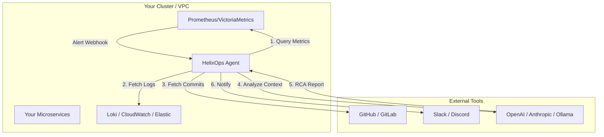

# HelixOps - AI SRE Agent

[](https://golang.org/)
[](https://opensource.org/licenses/MIT)
[]()
[](https://github.com/helixops/helixops/stargazers)

**The On-Call Copilot that lives in your cluster. An open-source alternative to Julius.**


*(Watch a [full 2-minute demo on YouTube](https://youtube.com/))*

## The Problem
It is 3am. An alert fires. You have 47 tabs open and no idea where to start.

## The Solution
HelixOps correlates your metrics, logs, and code changes automatically — and tells you exactly what broke and why, directly in Slack.

**Install in one line:**
```bash
helm install helixops ./helm/helixops
```

## Why HelixOps?
- **Privacy-First**: Keep your data in your VPC. Native support for local LLMs like Ollama.
- **Overlay, Not Rip-and-Replace**: Works seamlessly with your existing Prometheus, Loki, and GitHub stack. No vendor lock-in.
- **Lightweight & Fast**: Written in Go. Deploys as a single low-footprint binary in your cluster.
- **Open Source**: Fully open source alternative to tools like Julius, Datadog Bits AI, and Rootly AI.

## Features

- 🚨 **Alert Enrichment**: Automatically correlates alerts with metrics and code changes
- 📊 **Golden Signals**: Latency, error rate, and traffic analysis
- 🐛 **Log Mining**: Error log correlation and analysis
- 🤖 **AI-Powered RCA**: LLM-based root cause identification
- 📢 **Multi-Channel Output**: Slack/Discord notifications + Markdown reports
- 🔒 **Privacy-First**: Local Ollama support for sensitive environments
- 📝 **Automated Postmortems**: Generates an incident timeline, root cause, and rule-based remediation suggestions upon alert resolution.

### Output Example: Automated Postmortem

When an incident resolves, HelixOps automatically generates a `.md` postmortem like this:

```markdown
# Incident: HighLatency on cart-service
**Date:** 2024-05-20 10:15:00
**Duration:** 45m20s

## 1. Summary
The cart-service experienced a sudden latency spike causing checkout timeouts for users.

## 2. Root Cause
A recent database migration dropped an index on the carts table.

## Automated Rule-Based Suggestions
### Check Database Query Performance
High latency is often caused by unoptimized queries or missing indexes.

`Review slow query logs in your database provider or check APM traces for bottleneck spans.`
```

## Architecture



## Quick Start


## Project Structure

```
helixops/
├── cmd/agent/main.go           # Entry point
├── internal/
│   ├── server/                 # HTTP handlers
│   ├── clients/                # API clients
│   │   ├── prometheus/         # PromQL client
│   │   ├── github/            # GitHub API client
│   │   └── loki/              # LogQL client
│   ├── orchestrator/           # Context preparation
│   ├── analyzer/               # RCA logic
│   ├── output/                 # Output channels
│   └── config/                 # Configuration
├── pkg/llm/                    # LLM providers
├── config.yaml                 # Configuration file
├── Dockerfile                   # Container image
└── docker-compose.yml           # Development environment
```

## Deployment

### Docker

```bash
docker build -t helixops:latest .
docker run -p 8080:8080 \
  -v $(pwd)/config.yaml:/etc/helixops/config.yaml \
  helixops:latest
```

### Kubernetes

See `k8s/` directory for Kubernetes manifests.

### Helm

```bash
helm install helixops ./helm/helixops
```

## MCP Server Integration (Claude Desktop)

HelixOps includes a Model Context Protocol (MCP) server so that AI clients like Claude Desktop or Cursor can connect to it to query metrics and fetch RCA reports.

Add the following to your `claude_desktop_config.json`:

```json
{
  "mcpServers": {
    "helixops-mcp": {
      "command": "/path/to/helix-mcp",
      "env": {
        "GITHUB_TOKEN": "...",
        "OPENAI_API_KEY": "..."
      }
    }
  }
}
```

## Development

### Adding a New LLM Provider

1. Implement the `Provider` interface in `pkg/llm/provider.go`
2. Add provider type to `ProviderType` constants
3. Update `NewProvider()` factory function

### Adding a New Output Channel

1. Create new file in `internal/output/`
2. Implement `Send()` method
3. Add to `OutputConfig` in `config.yaml`

## Testing

```bash
# Run all tests
go test ./... -v

# Run with coverage
go test ./... -race -cover

# Run specific test
go test -v ./internal/server/...
```

## Contributing

1. Fork the repository
2. Create feature branch (`git checkout -b feature/amazing-feature`)
3. Commit changes (`git commit -m 'Add amazing feature'`)
4. Push to branch (`git push origin feature/amazing-feature`)
5. Open Pull Request

## License

MIT License - see LICENSE file for details.

## Support

- 📧 Email: support@helixops.io
- 💬 Discord: https://discord.gg/helixops
- 📖 Docs: https://docs.helixops.io
