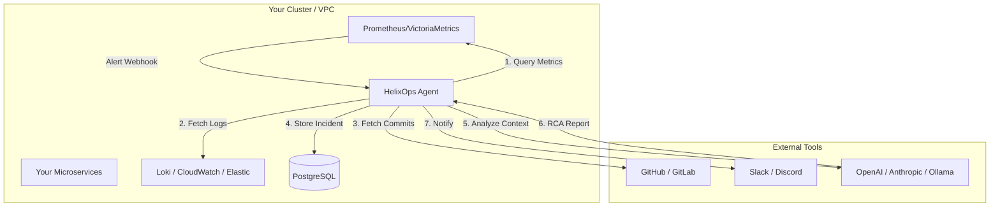

# HelixOps - AI SRE Agent

[](https://golang.org/)
[](https://opensource.org/licenses/MIT)
[]()
[](https://github.com/helixops/helixops/stargazers)

**AI-powered SRE Copilot — cloud or self-hosted, your choice.**

> *"When an alert fires, HelixOps investigates it before you even check Slack."*

*See HelixOps in action: [Quick Start](#quick-start) | [Example Output](#output-example-automated-postmortem)*

---

## The Problem
It is 3am. An alert fires. You have 47 tabs open and no idea where to start.

## The Solution
HelixOps correlates metrics, logs, and code changes automatically — and tells you exactly what broke and why, directly in Slack or your preferred channel.

---

## Why HelixOps?
- **Flexible Privacy**: Use cloud APIs (OpenAI, Anthropic) or run fully local with Ollama inside your VPC.
- **Overlay, Not Rip-and-Replace**: Works seamlessly with Prometheus, Loki, and GitHub. No migration required.
- **Lightweight & Fast**: Written in Go. Deploys as a single low-footprint binary in your cluster.
- **Open Source**: Fully MIT licensed. Community-driven development.

---

## Competitive Positioning

HelixOps takes a different approach compared to traditional observability platforms:

| | HelixOps | Traditional Platforms (Datadog, New Relic) | Incident Management (PagerDuty, Incident.io) |
|---|---|---|---|
| **Deployment** | Overlay on existing tools | Rip-and-replace | Separate system |
| **Privacy** | Local LLM option (Ollama) | Cloud-only | Cloud-only |
| **Integration** | Works with Prometheus/Loki/GitHub | Proprietary agents | Limited to alerts |
| **Automation** | AI-powered RCA & postmortems | Manual investigation | Manual runbooks |
| **Cost** | Open source (MIT) | Expensive SaaS | Per-user pricing |

**Key Differentiators:**
- **Zero Migration**: Use your existing Prometheus, Loki, and GitHub setup
- **Privacy-First**: Keep sensitive data in your VPC with local Ollama option
- **AI-Native**: Built from the ground up for LLM-powered incident analysis
- **Developer-Friendly**: Generates actionable postmortems, not just dashboards

---


## Features
- 🚨 **Alert Enrichment**: Correlates alerts with metrics and code changes
- 📊 **Golden Signals**: Latency, error rate, traffic analysis
- 🐛 **Log Mining**: Error log correlation and analysis
- 🤖 **AI-Powered RCA**: LLM-based root cause identification
- 📢 **Multi-Channel Output**: Slack notifications + Markdown reports
- 📝 **Automated Postmortems**: Fully automated generation of incident timeline, root cause analysis, and remediation suggestions - no human input required

---

### Output Example: Automated Postmortem

```markdown
# Incident: HighLatency on cart-service
**Date:** 2024-05-20 10:15:00
**Duration:** 45m20s

## 1. Summary
The cart-service experienced a sudden latency spike causing checkout timeouts.

## 2. Root Cause
A recent database migration dropped an index on the carts table.

## Automated Suggestions
### Check Database Query Performance
Review slow query logs or APM traces for bottlenecks.
```

---

## 🧠 LLM Modes

HelixOps supports multiple LLM backends depending on your environment:

### ⚡ Easy Mode (Cloud)
- OpenAI or Anthropic
- Minimal setup (API key only)
- Ideal for fast onboarding

### 🔒 Private Mode (Local)
- Ollama (fully local)
- Ideal for sensitive or regulated environments
- Runs entirely in your cluster/VPC

*Switch providers easily via configuration.*

---

## Architecture


```mermaid
graph TD
    subgraph User Infrastructure [Your Cluster / VPC]
        App[Your Microservices]
        Prom[Prometheus/VictoriaMetrics]
        Logs[Loki / CloudWatch / Elastic]
        DB[(PostgreSQL)]
        Helix[HelixOps Agent]
    end
    subgraph External Tools
        Git[GitHub / GitLab]
        Slack[Slack / Discord]
        LLM[OpenAI / Anthropic / Ollama]
    end
    Prom -->|Alert Webhook| Helix
    Helix -->|1. Query Metrics| Prom
    Helix -->|2. Fetch Logs| Logs
    Helix -->|3. Fetch Commits| Git
    Helix -->|4. Store Incident| DB
    Helix -->|5. Analyze Context| LLM
    LLM -->|6. RCA Report| Helix
    Helix -->|7. Notify| Slack
```

---

## Quick Start

```bash
# 1. Clone and start development
git clone https://github.com/helixops/helixops.git
cd helixops
docker-compose up -d

# 2. Configure setup
cp config.yaml.example config.yaml
# Edit config.yaml with API keys and settings

# 3. Run HelixOps
go run ./cmd/mcp
```

### Test It: Trigger a Sample Alert

Once HelixOps is running, send a test alert to see it in action:

```bash
# Send a test alert (adjust port if needed)
curl -X POST http://localhost:8080/webhook \
  -H "Content-Type: application/json" \
  -d @test-alert.json
```

If you don't have a `test-alert.json` file, create one with this content:

```json
{
  "alerts": [
    {
      "status": "firing",
      "labels": {
        "alertname": "HighLatency",
        "service_name": "cart-service",
        "severity": "critical"
      },
      "annotations": {
        "summary": "High latency detected on cart-service",
        "description": "p99 latency > 500ms for 5 minutes"
      },
      "startsAt": "2024-01-01T10:25:00Z"
    }
  ]
}
```

Check the HelixOps logs to see the analysis and look for Slack notifications or Markdown reports in the `./reports` directory.

---

## Configuration Example

```yaml
llm:
  provider: openai  # openai | anthropic | ollama

openai:
  api_key: your-openai-api-key

ollama:
  base_url: http://localhost:11434
  model: llama3.1
```

---

## Development

### Adding a New LLM Provider
1. Implement the `Provider` interface (`pkg/llm/provider.go`)
2. Add provider type to `ProviderType`
3. Update `NewProvider()` factory

### Adding a New Output Channel
1. Create new file in `internal/output/`
2. Implement `Send()` method
3. Add to `OutputConfig` in `config.yaml`

---

## Troubleshooting

Having issues? Check our comprehensive [TROUBLESHOOTING.md](docs/TROUBLESHOOTING.md) guide for common problems and solutions.

**Common Issues:**
- **Database connection failed**: Ensure PostgreSQL is running and credentials are correct
- **Webhook not reaching HelixOps**: Verify AlertManager configuration points to the correct URL
- **LLM API errors**: Check API keys and network connectivity to OpenAI/Anthropic
- **No output generated**: Verify Slack webhook URL or check the `./reports` directory for Markdown files

For detailed troubleshooting steps, see the full [TROUBLESHOOTING.md](docs/TROUBLESHOOTING.md) document.

---

## Documentation & Quick Links
- 📖 [ARCHITECTURE.md](docs/ARCHITECTURE.md) - System design overview
- 🚀 [DEPLOYMENT.md](docs/DEPLOYMENT.md) - Install in Docker, Kubernetes, or VMs
- 🔧 [CONFIGURATION.md](docs/CONFIGURATION.md) - Config reference and examples
- 📡 [API_REFERENCE.md](docs/API_REFERENCE.md) - Webhook and HTTP endpoints
- ✅ [TESTING.md](docs/TESTING.md) - Tests and CI/CD
- 👨‍💻 [CONTRIBUTING.md](docs/CONTRIBUTING.md) - Development guidelines

---

## License
MIT License - see LICENSE file

## Support
- 📖 Documentation: [docs/INDEX.md](docs/INDEX.md)
- 🐛 Issues: [GitHub Issues](https://github.com/helixops/helixops/issues)
- 💬 Discussions: [GitHub Discussions](https://github.com/helixops/helixops/discussions)
- 📧 Email: support@helixops.io

