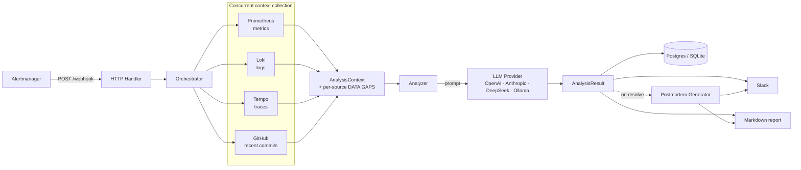

# HelixOps — AI SRE Agent

[](https://go.dev)
[](LICENSE)

**When an alert fires, HelixOps does the 2 a.m. context-gathering for you.** It ingests
an Alertmanager webhook, fans out concurrently to Prometheus, Loki, Tempo, and GitHub to
collect the relevant telemetry and recent deploys, asks an LLM for a root-cause analysis,
and posts the result to Slack and a Markdown report — then writes a postmortem when the
incident resolves.

It runs against a fully self-hosted observability stack and can use a **local LLM via
Ollama**, so incident data never has to leave your network.

> Built around a self-hosted observability stack with a pluggable LLM layer — run it
> against cloud models or fully local via Ollama.

---

## What it looks like

When `HighLatency` fires on `checkout-api`, the Slack message is enriched with analysis
and evidence rather than just the raw alert:

> 🚨 **Alert: HighLatency on checkout-api**
> **Severity:** critical  **Confidence:** 85%
> **AI Analysis:** Error rate rose from 0.2% to 4.1% beginning ~4 min after deploy
> `a3f9c2` ("switch to new payment client"). Latency P99 climbed 180ms → 920ms over the
> same window; logs show repeated `connection pool exhausted`. Probable cause: the new
> client ships a smaller default pool.
> **Latency:** 920ms (baseline 180ms)  **Error Rate:** 4.10% (baseline 0.20%)

<!-- TODO: replace the blockquote above with a real screenshot: docs/assets/slack-rca.png -->

A full Markdown RCA is also written to `./reports/`, and a postmortem is generated when
the alert resolves.

---

## Architecture


```mermaid
flowchart LR
    AM[Alertmanager] -->|POST /webhook| H[HTTP Handler]
    H --> O[Orchestrator]

    subgraph C[Concurrent context collection]
        direction TB
        P[Prometheus<br/>metrics]
        L[Loki<br/>logs]
        T[Tempo<br/>traces]
        G[GitHub<br/>recent commits]
    end

    O --> P & L & T & G
    P & L & T & G --> CTX[AnalysisContext<br/>+ per-source DATA GAPS]
    CTX --> A[Analyzer]
    A -->|prompt| LLM[LLM Provider<br/>OpenAI · Anthropic · DeepSeek · Ollama]
    LLM --> R[AnalysisResult]
    R --> S[Slack]
    R --> MD[Markdown report]
    R --> DB[(Postgres / SQLite)]
    R -. on resolve .-> PM[Postmortem Generator]
    PM --> S & MD
```

**Flow:** alert → concurrent multi-source context gather → LLM analysis → fan-out to
outputs and storage. Any single source can fail without sinking the analysis — the gap
is recorded and passed to the model as context.

---

## Interesting engineering decisions

These are the parts worth reading:

- **Concurrent fan-out with per-source graceful degradation**
  ([`internal/orchestrator/context.go`](internal/orchestrator/context.go)) — Prometheus,
  Loki, Tempo, and GitHub are queried in parallel; each result is tagged by source, and a
  failure in one becomes a recorded "DATA GAP" passed to the LLM rather than an error that
  aborts the whole incident analysis.

- **Pluggable LLM provider abstraction** ([`pkg/llm/`](pkg/llm/)) — a single `Provider`
  interface backs four interchangeable implementations (OpenAI, Anthropic, DeepSeek, and
  local Ollama), selected by config. Providers optionally implement a `Health` checker
  that the `/health` endpoint surfaces, so a bad API key fails fast instead of on the
  first real alert.

- **Privacy-capable by design** — because the whole pipeline can run against self-hosted
  Prometheus/Loki/Tempo and a local Ollama model, telemetry never has to leave the
  network. The cloud providers are an option, not a requirement.

- **Tolerant response parsing** ([`internal/analyzer/rca.go`](internal/analyzer/rca.go)) —
  the analyzer extracts confidence and next-steps from the model's Markdown without
  assuming perfect formatting (lenient heading/bullet matching), so smaller local models
  degrade gracefully instead of producing empty fields.

### Where to look first

| File | Why it's worth a look |
|------|----------------------|
| [`internal/orchestrator/context.go`](internal/orchestrator/context.go) | Concurrency + partial-failure handling |
| [`pkg/llm/provider.go`](pkg/llm/provider.go) | The provider abstraction / factory |
| [`internal/analyzer/rca.go`](internal/analyzer/rca.go) | Prompt construction + tolerant parsing |
| [`internal/server/handlers.go`](internal/server/handlers.go) | Webhook + health/readiness endpoints |

---

## Quick start

```bash
# 1. Bring up the stack (Prometheus, Loki, Tempo, Ollama, Postgres, …)
docker-compose up -d

# 2. Run the agent (loads config.yaml; defaults to local Ollama)
go run ./cmd/agent

# 3. Send a sample Alertmanager payload
curl -X POST http://localhost:8080/webhook \
  -H "Content-Type: application/json" \
  -d @test-alert.json
```

The analysis is written to `./reports/` (and to Slack if `SLACK_WEBHOOK_URL` is set).

**Endpoints:** `POST /webhook` · `GET /health` · `GET /ready` · `GET /postmortems` ·
`GET /postmortems/{id}`

**Common tasks** (see [`Makefile`](Makefile)): `make build` · `make test` (race + cover)
· `make docker-run`

There's also an MCP server entry point for tool-style use: `go run ./cmd/mcp`.

---

## Configuration

The agent loads `config.yaml` from the workspace root, `./config`, or `/etc/helixops`,
then merges environment variable overrides.

| Concern | How it's configured |
|---------|---------------------|
| LLM provider | `llm.provider`: `openai` · `anthropic` · `deepseek` · `ollama` |
| Cloud API key | `OPENAI_API_KEY` / `ANTHROPIC_API_KEY` / `DEEPSEEK_API_KEY` (per provider) |
| Local model | `llm.ollama_url` + `llm.ollama_model` |
| Telemetry | Prometheus + Loki (Tempo optional) |
| Commits | GitHub token + service→repo mapping |
| Storage | `database.type`: `postgres` or `sqlite` |
| Notifications | `SLACK_WEBHOOK_URL` |

Full schema and env names: [docs/CONFIGURATION.md](docs/CONFIGURATION.md).

---

## Tech stack

**Go** · Alertmanager · Prometheus · Loki · Tempo · OpenTelemetry · GitHub API ·
Postgres / SQLite · Slack · LLMs (OpenAI / Anthropic / DeepSeek / Ollama) · chi router ·
Viper config · structured logging (`slog`).

---

## Documentation

- [Architecture](docs/ARCHITECTURE.md) · [Configuration](docs/CONFIGURATION.md) ·
  [Deployment](docs/DEPLOYMENT.md) · [API reference](docs/API_REFERENCE.md) ·
  [Testing](docs/TESTING.md) · [Troubleshooting](docs/TROUBLESHOOTING.md)
- [Security](SECURITY.md) · [Changelog](CHANGELOG.md)
